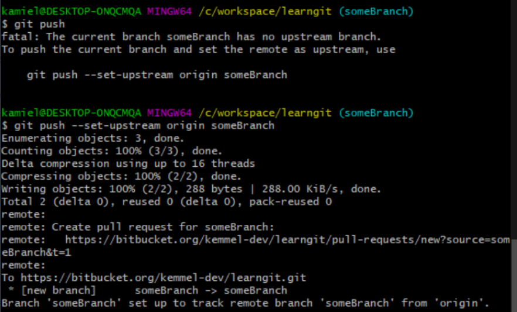

# Git Cheatsheet

by Kamiel de Visser

First: This video series by TheCodingTrain is an incredibly helpful source to learn the basics of git and why you should use it: [https://www.youtube.com/watch?v=BCQHnlnPusY](https://www.youtube.com/watch?v=BCQHnlnPusY)

# Terms

`remote repository` is the repository on [github.com](http://github.com/)

`local repository` is the repository on your own computer

## Commands

`ls` lists all the files in the current folder

`cd <path>` changes directories to Path

`cd ..` moves one directory up

`git clone <url>` clones a repository into the currentDit/repoName folder

`git status` shows you the current changes youve made to files and the amount of
changes that you have opposed to the remote repository

`git add <filepath>` makes git track a file, and stages it for a commit.

`git add .` adds literally evyerthing in your folder

`git add *` also adds literally everything in your folder, but works a bit differently: 

`.` is a 'and everything else' token. So for example the word `cheese` is caught by `*`,
`*se` , or `*eese` but not by `*eeke`.

`git commit -m "<message>"` commits your currently added files with a message.

`git pull` gets all the changes on the current branch

`git fetch` gets all the changes on every branch

`git push` pushes your changes

`git branch` lists all the available branches

`git checkout <branchName>` checks out to a branch called `branchName`

`git checkout -b <branchName>` creates a branch called `branchName` and checks out to
that branch

`git merge <branchName>` merges the branch called `branchName` into the *current branch*

## Default workflow

(if its a new repository or other branches have been added by your teammates)

`git fetch` —> Makes sure you are up to date on all branches

`git pull` —> Pulls the incoming changes from your remote repository to your local repository (if any)

`git status` —> should show you that everything is up to date (else, you should solve those issues first, i.e. when it shows you have untracked or uncomitted files, commit those first)


`git branch` —> to see the available branches

`git checkout <branchName>` —> to go to the branch you want to work on
now work on your files

Once youve done some work, you are ready to commit your work.

`git status` —> Check if youve only worked on files you wanted to work on


`git add <files>` —> Add every file that you have worked on. (Use shorthands with `.` or `*`
to type less)

`git status` —> Check whether only the files that you wanted to work on are under the
staged files

`git commit -m "message"` —> commits your work with a message


`git push` —> push all your work to the remote repository



### OPTIONAL

(dont use this unless you know what you are doing. If you don’t: please use pull requests through the interface on the corresponding website (i.e. if you are using github, github.com))

`git checkout main` go back to the `main` branch

`git merge branchName` merge the `branchName` into `main`

## Example log

This is an example output log of the default workflow.

```markdown
kamiel@DESKTOP-ONQCMQA MINGW64 /c/workspace/learngit (main)
$ git fetch

kamiel@DESKTOP-ONQCMQA MINGW64 /c/workspace/learngit (main)
$ git pull

Already up to date.

kamiel@DESKTOP-ONQCMQA MINGW64 /c/workspace/learngit (main)
$ git status

On branch main
Your branch is up to date with 'origin/main'.
nothing to commit, working tree clean

kamiel@DESKTOP-ONQCMQA MINGW64 /c/workspace/learngit (main)
$ git branch

* main

kamiel@DESKTOP-ONQCMQA MINGW64 /c/workspace/learngit (main)
$ git checkout -b someBranch

Switched to a new branch 'someBranch'

kamiel@DESKTOP-ONQCMQA MINGW64 /c/workspace/learngit (someBranch)
$ git status

On branch someBranch
Changes not staged for commit:
(use "git add/rm <file>..." to update what will be committed)
(use "git restore <file>..." to discard changes in working directory)
deleted: DONTREADME.md
deleted: README.md
Untracked files:
(use "git add <file>..." to include in what will be committed)
commitme.md
dontcommitme.md
no changes added to commit (use "git add" and/or "git commit -a")

kamiel@DESKTOP-ONQCMQA MINGW64 /c/workspace/learngit (someBranch)
$ git add .

kamiel@DESKTOP-ONQCMQA MINGW64 /c/workspace/learngit (someBranch)
$ git status

On branch someBranch
Changes to be committed:
(use "git restore --staged <file>..." to unstage)
renamed: README.md -> commitme.md
renamed: DONTREADME.md -> dontcommitme.md

kamiel@DESKTOP-ONQCMQA MINGW64 /c/workspace/learngit (someBranch)
$ git restore --staged dontcommitme.md

kamiel@DESKTOP-ONQCMQA MINGW64 /c/workspace/learngit (someBranch)
$ git status

On branch someBranch
Changes to be committed:
(use "git restore --staged <file>..." to unstage)
deleted: DONTREADME.md
renamed: README.md -> commitme.md
Untracked files:
(use "git add <file>..." to include in what will be committed)
dontcommitme.md

kamiel@DESKTOP-ONQCMQA MINGW64 /c/workspace/learngit (someBranch)
$ git commit -m "renamed these files for reasoh xyz"

[someBranch 92d1715] renamed these files for reasoh xyz
2 files changed, 3 deletions(-)
delete mode 100644 DONTREADME.md
rename README.md => commitme.md (100%)

kamiel@DESKTOP-ONQCMQA MINGW64 /c/workspace/learngit (someBranch)
$ git push

fatal: The current branch someBranch has no upstream branch.
To push the current branch and set the remote as upstream, use
git push --set-upstream origin someBranch

kamiel@DESKTOP-ONQCMQA MINGW64 /c/workspace/learngit (someBranch)
$ git push --set-upstream origin someBranch

Enumerating objects: 3, done.
Counting objects: 100% (3/3), done.
Delta compression using up to 16 threads
Compressing objects: 100% (2/2), done.
Writing objects: 100% (2/2), 288 bytes | 288.00 KiB/s, done.
Total 2 (delta 0), reused 0 (delta 0), pack-reused 0
remote:
remote: Create pull request for someBranch:
remote: https://bitbucket.org/kemmel-dev/learngit/pull-requests/new?
source=som
eBranch&t=1
remote:
To https://bitbucket.org/kemmel-dev/learngit.git
* [new branch] someBranch -> someBranch
Branch 'someBranch' set up to track remote branch 'someBranch' from 'origin'.

kamiel@DESKTOP-ONQCMQA MINGW64 /c/workspace/learngit (someBranch)
$ git checkout main

Switched to branch 'main'
Your branch is up to date with 'origin/main'.

kamiel@DESKTOP-ONQCMQA MINGW64 /c/workspace/learngit (main)
$ git merge someBranch

Updating ce1416f..92d1715
Fast-forward
DONTREADME.md | 3 ---
README.md => commitme.md | 0
2 files changed, 3 deletions(-)
delete mode 100644 DONTREADME.md
rename README.md => commitme.md (100%)

kamiel@DESKTOP-ONQCMQA MINGW64 /c/workspace/learngit (main)
$ git push

Total 0 (delta 0), reused 0 (delta 0), pack-reused 0
To https://bitbucket.org/kemmel-dev/learngit.git
ce1416f..92d1715 main -> main
```
